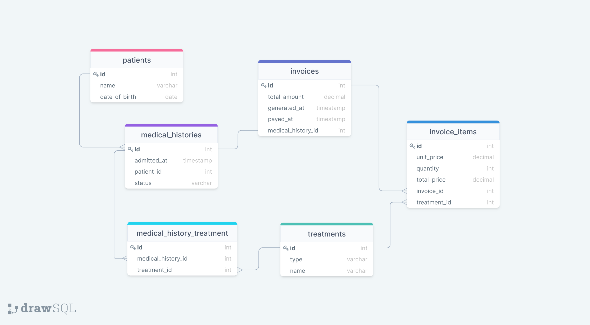

# Clinic

## Description

> "Clinic Database" is a project where I use a relational database to create the initial data structure for a clinic that includes a tables about the Clinic.
The schema_based_on_digram.sql created based on a diagram automaticaly.

## Diagram

## Getting Started

This repository includes files with plain SQL that can be used to recreate a database:

- Use [schema.sql](https://github.com/souad988/clinic/blob/database_from_diagram/schema_based_on_diagram.sql) to create all tables.

This project is build with:

- SQL

To get the content of this project locally you need to run these commands in your terminal.
Before starting the steps below, be sure you have [Git](https://www.linode.com/docs/guides/how-to-install-git-on-linux-mac-and-windows/).
1. `git clone https://github.com/souad988/clinic.git`
2. `cd clinic`

## Authors

👤 **Souad El Mansouri**

- GitHub: [@souad988](https://github.com/souad988)
- Twitter: [@souadElmansouri](@souadElmansouri)
- LinkedIn: [Souad el mansouri](https://www.linkedin.com/in/souad-el-mansouri/)

👤 **Candy Inga Cynthia**

- GitHub: [@cynthiainga](https://github.com/cynthiainga)
- Twitter: [@CynthiaInga_C](https://twitter.com/CynthiaInga_C)
- LinkedIn: [Cynthia Inga](https://www.linkedin.com/in/cynthia-inga/)

## 🤝 Contributing

Contributions, issues, and feature requests are welcome!

Feel free to check the [issues page](https://github.com/souad988/clinic/issues).

## Show your support

Give a ⭐️ if you like this project!

## Acknowledgments

- Thanks to everyone who will get time to check this project especially to code reviewers.

## 📝 License

This project is [MIT](./MIT.md) licensed.
